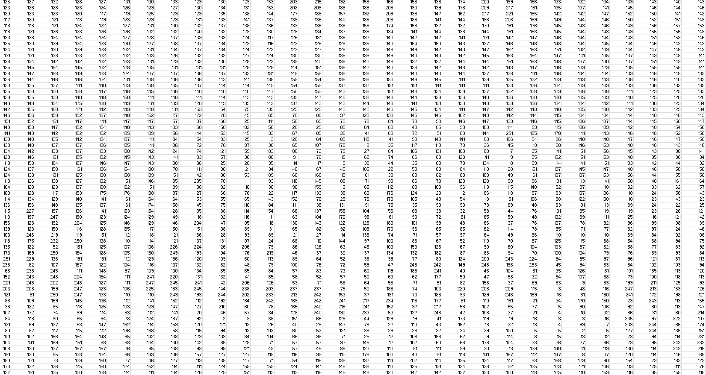

# My Understanding of CNNs

### How do computers see images

First lets understand how a computer sees an image as opposed to how we see an image.

Let us take a grayscale image of a cat, we humans see a cat with ears, nose, eyes and other distinguishable features, but what 
a computer sees is just a lot of numbers stacked in a matrix.

#### This a grayscale image of a cat

#### This is how the computer sees this image of a cat

Our objective is to make the computer learn how to differentiate between images using these stacked numbers. We humans can differentiate whether the picture contains a cat or a dog but how can we train the computer to make this prediction?

We use Convolutional Neural Network for this purpose. 

Let us see why we discard the normal neural network for this task

A normal neural network takes a flat 1-D matrix as input and does not really capture the relationship between pixels and only learning to differentiate using the raw pixel values. As we need to establish the spatial relationship between pixel values so as to learn specific features of an image we don't consider using a normal neural network as it would miss these spatial relations.
Also when we convert a picture of 256x256x3 dimension into a flat 1D array to be fed into a neural network, we begin with an input of 196608 nodes which  would then have to be permuted with the input layers adding more to the number of actual weights involved and hence introducing far too many parameters for computation.

### What are filters/kernels?

The filters/kernels can be considered analogous to the neurons from a normal network. These filters/kernels are the weights that are updated or in other words this is where the learning happens in a CNN. The filters/kernals are smaller matrices which slides through an image from top left top bottom right spanning the whole image while calculating the dot product of the values and storing them in the output feature map. I am sure that made no sense to you, So just see the GIF below and it would speak those 1000 words that I am trying to convey.

