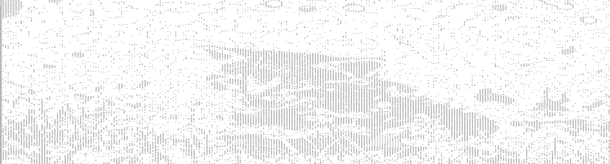
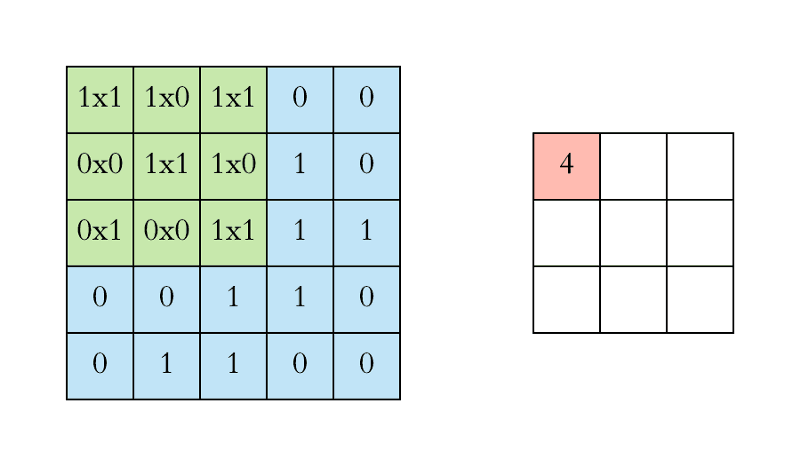

# My Understanding of CNNs

### How do computers see images

First lets understand how a computer sees an image as opposed to how we see an image.

Let us take a grayscale image of a cat, we humans see a cat with ears, nose, eyes and other distinguishable features, but what 
a computer sees is just a lot of numbers stacked in a matrix.

#### This a grayscale image of a cat

#### This is how the computer sees this image of a cat

Our objective is to make the computer learn how to differentiate between images using these stacked numbers. We humans can differentiate whether the picture contains a cat or a dog but how can we train the computer to make this prediction?

We use Convolutional Neural Network for this purpose. 

Let us see why we discard the normal neural network for this task

A normal neural network takes a flat 1-D matrix as input and does not really capture the relationship between pixels and only learning to differentiate using the raw pixel values. As we need to establish the spatial relationship between pixel values so as to learn specific features of an image we don't consider using a normal neural network as it would miss these spatial relations.
Also when we convert a picture of 256x256x3 dimension into a flat 1D array to be fed into a neural network, we begin with an input of 196608 nodes which  would then have to be permuted with the input layers adding more to the number of actual weights involved and hence introducing far too many parameters for computation.

image source : https://towardsdatascience.com/applied-deep-learning-part-4-convolutional-neural-networks-584bc134c1e2
### What are filters/kernels?

The filters/kernels can be considered analogous to the neurons from a normal network. These filters/kernels are the weights that are updated or in other words this is where the learning happens in a CNN. The filters/kernals are smaller matrices which slides through an image from top left top bottom right spanning the whole image while calculating the dot product of the values and storing them in the output feature map. I am sure that made no sense to you, So just see the GIF below and it would speak those 1000 words that I am trying to convey.

image source : https://towardsdatascience.com/applied-deep-learning-part-4-convolutional-neural-networks-584bc134c1e2

Let me try again now that you have looked at the GIF.
Let us assume we have 5 such filters/kernels that run over an image of a cat. As the network backpropagates and adjusts the values in these filters in the process of learning to differentiate between a cat and a dog. A good way to understand the role of these filters is to assume that each of these filters that we have are responsible in capturing specific features of the image, Let us say that out of the 5 filters we use in training one learns to detect ears, one learns to detect nose, one learns to detect the left eye, one learns to detect vertical edges, one learns to detect the texture etc. 
By means of training a CNN on images using multiple filters/kernels we are enabling the computer to do what a human does when he/she is seeing an image. We teach the computer to not see just the matrix of numbers but we teach it to detect distinguishable features.

Okay, Let us get back to some important terms that would be used with reference to convolutions. As you have noticed in the GIF that a 5x5 image when convolved with a 3x3 filter produces a 3x3 feature map. If we are using 10 filters we would end up with 10 such 3x3 feature maps after the first layer of the CNN. We would then stack these 10 maps to form a volume of 3x3x10 and this would be used as an input for the second layer of convolution filters. It is important to note that the filters always should match the depth with the depth of the input volume it receives.

To make this more clear, if we convolve the intial RGB image, our filters should mandatorily have a depth of 3 to include all the channels even though it would slowly span through the whole image in the process of convolving. 
If we used 10 filters on the RGB image, we would get a volume of features with dimension 3x3x10. 
Now the second layer of filters should have a depth of 10 similar to how the first layer of filters had a depth of 3.
This is because we are moving the filter only in the horizontal and vertical direction but not in the depth dimension.

### Padding

As we have noticed that we lose dimensions from one layer of convolutions to start with a 5x5 image and then to have a feature volume of 3x3x10. This loss of dimension would be significantly amplified if we go deep with more layers. As we go deeper into the layers we would keep losing more and more dimension shrinking the input volume received by the consecutive layers.
To compensate for this we use a technique called zero padding where-in we pad zeros around the initial matrix before we convolve it so as to conserve the dimension. 
It is important also to note that the contribution from the corners of the images would be less compared to the areas in the middle since  the filter doesnt span a lot on the corners, but if we use zero padding we would increase the contribution of the corners of images to the feature maps.

### Stride

Stride is the parameter that defines how the filters move around the image and span its height and width, it basically is the number of pixels at a time a filter would move. Below is an example of a stride of 1.

image source : https://medium.freecodecamp.org/an-intuitive-guide-to-convolutional-neural-networks-260c2de0a050

### Pooling

Consider a filter/kernel that moves around the feature volume and takes takes the average of the considered volume or the maximum value from its current slice. Imagine a 2x2 kernel that moves through the image/feature output, this kernel will approximate the considered 2x2 area of 4 pixels with the maximum value of the 4 pixels. Yet again, I think the below picture would convey the concept more than my words.

image source : http://cs231n.github.io/convolutional-networks/

note: Even though we use kernels to do pooling, the pooling layer offers no learning. It is just used as a dimensionality reduction tool which also brings in a useful property of introducing spatial invariance into our learning process.

### Summary of CNNs
To summarize, the important parameters to know regarding a CNN are :
  1. The filter/kernel dimensions or size
  2. The number of filters/kernels used
  3. The Stride
  4. Maxpooling kernel size
  
  
Below is an image which shows all the concepts that are discussed above. This should help you understand the complete flow through a CNN network.

image source : http://cs231n.github.io/convolutional-networks/

All talk but no code makes this repo a boring one, so why not dive into some fun implementations of CNN filters and what they can visualize or capture from a given image :

  * [CNN Filter visualizations](https://iamanemic.github.io/cnn_filter_visualization/)

